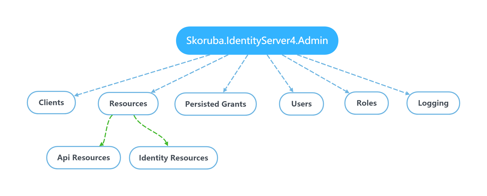
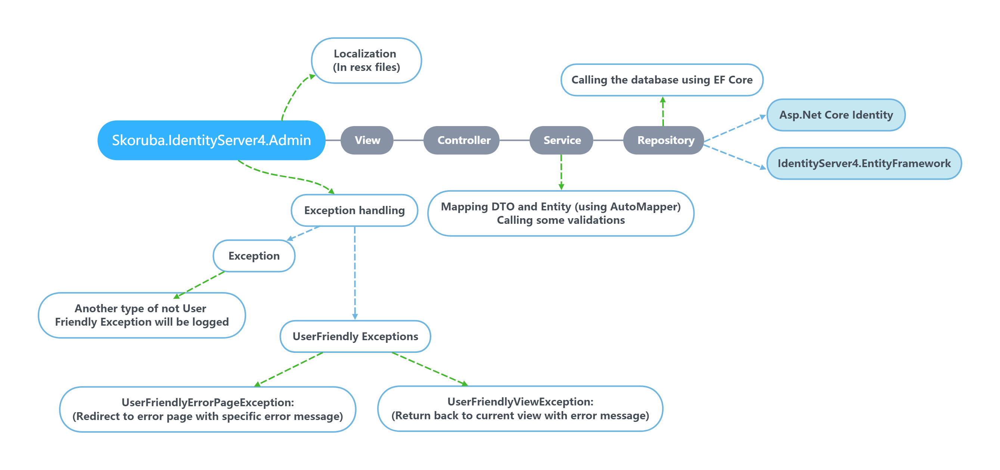

## Labsoft.IdentityCenter - ASP.NET 6
This is the complete solution Labsoft Identity Center. The Labsoft Identity Center is basead on [Skoruba Identity Server Admin] (https://github.com/skoruba/IdentityServer4.Admin).

The Skoruba Identity Server Admin (or Skoruba Identity Center) is an open-source project that provides an administrative interface for managing IdentityServer, a popular solution for implementing authentication and authorization using OAuth 2.0 and OpenID Connect in .NET applications.

The main goal of Skoruba Identity Center is to simplify the management of users, roles, clients, scopes, and resources related to authentication and authorization through a user-friendly, visual interface.

## Code
C# with ASP.NET 6.

## How to configure the Administration - IdentityServer4 and Asp.Net Core Identity

- [Follow these steps for setup project to use existing IdentityServer4 and Asp.Net Core Identity](docs/Configure-Administration.md)

### Running in Visual Studio

- Set Startup projects:
  - Skoruba.IdentityServer4.Admin
  - Skoruba.IdentityServer4.Admin.Api
  - Skoruba.IdentityServer4.STS.Identity

## Configuration of Administration for Deployment

- [Configuration of Admin for deploy on Azure](docs/Configure-Azure-Deploy.md)
- [Configuration of Admin on Ubuntu with PostgreSQL database](docs/Configure-Ubuntu-PostgreSQL-Tutorial.md)

## EF Core & Data Access

- The solution uses these `DbContexts`:

  - `AdminIdentityDbContext`: for Asp.Net Core Identity
  - `AdminLogDbContext`: for logging
  - `IdentityServerConfigurationDbContext`: for IdentityServer configuration store
  - `IdentityServerPersistedGrantDbContext`: for IdentityServer operational store
  - `AdminAuditLogDbContext`: for Audit Logging
  - `IdentityServerDataProtectionDbContext`: for dataprotection

### Run entity framework migrations:

> NOTE: Initial migrations are a part of the repository.

  - It is possible to use powershell script in folder `build/add-migrations.ps1`.
  - This script take two arguments:
    - --migration (migration name)
    - --migrationProviderName (provider type - available choices: All, SqlServer, MySql, PostgreSQL)

- For example: 
`.\add-migrations.ps1 -migration DbInit -migrationProviderName SqlServer`

### Available database providers:
- SqlServer
- MySql
- PostgreSQL

> It is possible to switch the database provider via `appsettings.json`:
```
"DatabaseProviderConfiguration": {
        "ProviderType": "SqlServer" 
    }
```

## Authentication and Authorization

- Change the specific URLs and names for the IdentityServer and Authentication settings in `appsettings.json`
- In the controllers is used the policy which name is stored in - `AuthorizationConsts.AdministrationPolicy`. In the policy - `AuthorizationConsts.AdministrationPolicy` is defined required role stored in - `appsettings.json` - `AdministrationRole`.
- With the default configuration, it is necessary to configure and run instance of IdentityServer4. It is possible to use initial migration for creating the client as it mentioned above

### Admin Configuration

Admin and STS can be customized without editing code in `appsettings.json` under AdminConfiguration section

## How to configure an external provider in STS

- In `Skoruba.IdentityServer4.STS.Identity/Helpers/StartupHelpers.cs` - is method called `AddExternalProviders` which contains the example with `GitHub`, `AzureAD` configured in `appsettings.json`:

```
"ExternalProvidersConfiguration": {
        "UseGitHubProvider": false,
        "GitHubClientId": "",
        "GitHubClientSecret": "",
        "UseAzureAdProvider": false,
        "AzureAdClientId": "",
        "AzureAdTenantId": "",
        "AzureInstance": "",
        "AzureAdSecret": "",
        "AzureAdCallbackPath": "",
        "AzureDomain": "" 
}
```

- It is possible to extend `ExternalProvidersConfiguration` with another configuration properties.
- If you use DockerHub built image, you can use appsettings to configure these providers without changing the code
  - GitHub
  - AzureAD

### List of external providers for ASP.NET Core:
  - https://github.com/aspnet-contrib/AspNet.Security.OAuth.Providers
  - https://docs.microsoft.com/en-us/aspnet/core/security/authentication/social/
 
### Azure AD
- Great article how to set up Azure AD:
  - https://docs.microsoft.com/en-us/azure/active-directory/develop/quickstart-v2-aspnet-core-webapp

## Overview

### Solution structure:

- STS:

  - `Skoruba.IdentityServer4.STS.Identity` - project that contains the instance of IdentityServer4 and combine these samples - [Quickstart UI for the IdentityServer4 with Asp.Net Core Identity and EF Core storage](https://github.com/IdentityServer/IdentityServer4/tree/master/samples/Quickstarts/9_Combined_AspId_and_EFStorage) and [damienbod - IdentityServer4 and Identity template](https://github.com/damienbod/IdentityServer4AspNetCoreIdentityTemplate)

- Admin UI Api:

  - `Skoruba.IdentityServer4.Admin.Api` - project with Api for managing data of IdentityServer4 and Asp.Net Core Identity, with swagger support as well

- Admin UI:

  - `Skoruba.IdentityServer4.Admin.UI` - ASP.NET Core MVC application that contains Admin UI

  - `Skoruba.IdentityServer4.Admin` - ASP.NET Core MVC application that uses Admin UI package and it's only for application bootstrap

  - `Skoruba.IdentityServer4.Admin.BusinessLogic` - project that contains Dtos, Repositories, Services and Mappers for the IdentityServer4

  - `Skoruba.IdentityServer4.Admin.BusinessLogic.Identity` - project that contains Dtos, Repositories, Services and Mappers for the Asp.Net Core Identity

  - `Skoruba.IdentityServer4.Admin.BusinessLogic.Shared` - project that contains shared Dtos and ExceptionHandling for the Business Logic layer of the IdentityServer4 and Asp.Net Core Identity

  - `Skoruba.IdentityServer4.Shared` - Shared common Identity DTOS for Admin UI, Admin UI Api and STS

  - `Skoruba.IdentityServer4.Shared.Configuration` - Shared common layer for Admin UI, Admin UI Api and STS

  - `Skoruba.IdentityServer4.Admin.EntityFramework` - EF Core data layer that contains Entities for the IdentityServer4

  - `Skoruba.IdentityServer4.Admin.EntityFramework.Configuration` - EF Core data layer that contains configurations

  - `Skoruba.IdentityServer4.Admin.EntityFramework.Identity` - EF Core data layer that contains Repositories for the Asp.Net Core Identity
  
  - `Skoruba.IdentityServer4.Admin.EntityFramework.Extensions` - project that contains extensions related to EntityFramework

  - `Skoruba.IdentityServer4.Admin.EntityFramework.Shared` - project that contains DbContexts for the IdentityServer4, Logging and Asp.Net Core Identity, inluding shared Identity entities

  - `Skoruba.IdentityServer4.Admin.EntityFramework.SqlServer` - project that contains migrations for SqlServer

  - `Skoruba.IdentityServer4.Admin.EntityFramework.MySql` - project that contains migrations for MySql

  - `Skoruba.IdentityServer4.Admin.EntityFramework.PostgreSQL` - project that contains migrations for PostgreSQL


- Tests:

  - `Skoruba.IdentityServer4.Admin.IntegrationTests` - xUnit project that contains the integration tests for AdminUI
  
  - `Skoruba.IdentityServer4.Admin.Api.IntegrationTests` - xUnit project that contains the integration tests for AdminUI Api

  - `Skoruba.IdentityServer4.Admin.UnitTests` - xUnit project that contains the unit tests for AdminUI

  - `Skoruba.IdentityServer4.STS.IntegrationTests` - xUnit project that contains the integration tests for STS

### The admininistration contains the following sections:



## IdentityServer4

**Clients**

It is possible to define the configuration according the client type - by default the client types are used:

- Empty
- Web Application - Server side - Authorization Code Flow with PKCE
- Single Page Application - Javascript - Authorization Code Flow with PKCE
- Native Application - Mobile/Desktop - Authorization Code Flow with PKCE
- Machine/Robot - Client Credentials flow
- TV and Limited-Input Device Application - Device flow

- Actions: Add, Update, Clone, Remove
- Entities:
  - Client Cors Origins
  - Client Grant Types
  - Client IdP Restrictions
  - Client Post Logout Redirect Uris
  - Client Properties
  - Client Redirect Uris
  - Client Scopes
  - Client Secrets

**API Resources**

- Actions: Add, Update, Remove
- Entities:
  - Api Claims
  - Api Scopes
  - Api Scope Claims
  - Api Secrets
  - Api Properties

**Identity Resources**

- Actions: Add, Update, Remove
- Entities:
  - Identity Claims
  - Identity Properties

## Asp.Net Core Identity

**Users**

- Actions: Add, Update, Delete
- Entities:
  - User Roles
  - User Logins
  - User Claims

**Roles**

- Actions: Add, Update, Delete
- Entities:
  - Role Claims

## Application Diagram



****

## Tech Stack  

- [Design type](https://labsofttecnologia.sharepoint.com/teams/LabsoftWiki/SitePages/Design-type.aspx)
- [Unit tests](https://labsofttecnologia.sharepoint.com/teams/LabsoftWiki/SitePages/Unit-test.aspx)
- [Restful](https://labsofttecnologia.sharepoint.com/teams/LabsoftWiki/SitePages/RESTful-Web-API-Design.aspx)
- [Code Review](https://labsofttecnologia.sharepoint.com/teams/LabsoftWiki/SitePages/Code-review.aspx)
